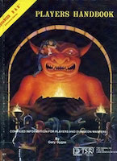
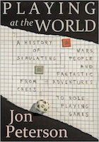
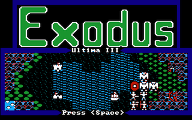
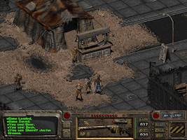
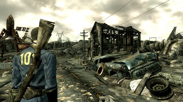
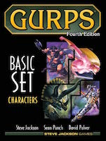
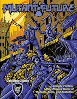
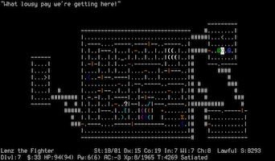
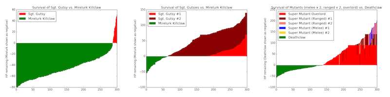
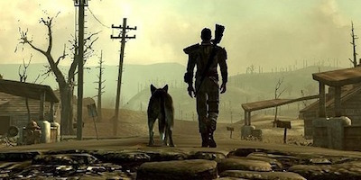

:css: css/talk.css

.. That's the light-background version.

.. Commenting out :css: css/talk_dark.css

..  Swap that in if you want the dark-background version

:title: Fallout Pen-and-Paper
:author: Adam Thornton

Fallout Pen-and-Paper
#####################

Adam Thornton
=============

Speaking As A Private Individual
================================

athornton@gmail.com

----

.. role:: raw-role(raw)
    :format: html

.. role:: strike
    :class: strike

Background
##########

I run multiple pen-and-paper role-playing games (henceforth, RPGS).

Earlier this year, I wrapped up a game for my face-to-face St. Louis
group.

|fallout|

They said that they would like to play something like *Fallout* next.

After kicking around some options, we decided, why not just play a
*Fallout* RPG?  It's not like I'm going to try to sell it.

- At least not without filing off the serial numbers.

----

What's an RPG? (obligatory slide)
#################################

Really?  Is there anyone here who actually needs me to tell you this? |patw|

You should read Jon Peterson's *Playing At The World* anyway.
You will learn new things.

- https://playingattheworld.blogspot.com/

Quick history:

- *Braunstein*

- *Dungeons and Dragons* |phb|

- The 80s, pop phenomenon, Satanic Panic, and backlash

 - Early CRPGs

 - Crash (analogous to Video Game Crash of '84)

- Mainstreaming of nerdiness

- OSR/DIY

----

Computer RPGs
#############

We didn't always have free worldwide videoconferencing, you know. |ultima3|

Especially in small towns it could be hard to find a game.

Computer games were the next best thing.

- *Zork*, Scott Adams, Infocom

- *Rogue*, *Wizardry*, *Ultima*, et cetera

- These diverged by the late 80s into "Adventure" and "CRPG" genres

----

Fallout
#######

|wasteland|

Does anyone here need this slide either?

Spiritual successor of *Wasteland* (EA, 1988)

|

|

*Fallout*: 1997  |fallout1| |fallout2|

*Fallout 2*: 1998

.. |wasteland| image:: images/wasteland.jpg

.. |fallout2| image:: images/fallout2.jpg

----

*Fallout 3-New Vegas-4*
#######################

|fallout3| The *Fallout* I'm basing my game on is the set of more recent
3D Fallout games: *Fallout 3* (2008), *Fallout: New Vegas* (2010),
*Fallout 4* (2015). 

|

|

|fallout_nv|

|fallout4|

Post-apocalyptic retro-future: robots, tailfins, the Ink Spots.

.. |fallout4| image:: images/fallout4.jpg

----

Fallout As a Pen-and-Paper RPG
##############################

Back in the day, computer RPGs couldn't really have that much more math
than actual RPGs.

*Wasteland* was designed by Ken St. Andre, Mike Stackpole, and Liz
Danforth. |t_n_t|

- They wrote *Tunnels and Trolls*, an early D&D competitor (and still
  being published today!  7th edition now). 

- *Wasteland* used a variant of *T&T*

*Fallout* was going to use *GURPS* by Steve Jackson Games but
negotiations collapsed.

So it uses its own system.

.. |t_n_t| image:: images/t_n_t.png

----

Fallout's SPECIAL System
########################

|pip-boy| 7 statistics: Strength, Perception, Endurance, Charisma, Intelligence,
Agility, Luck.

Some number of skills, whose base chance is derived from statistics, and
which can improve over time.  These have generally been
percentile-based, although sometimes the cap has been 200% (don't think
too hard about that).

At a glance, it's a lot like Chaosium's Basic Role-Playing (better
known to most people via *Call of Cthulhu*) with the stats halved.

.. |pip-boy|  image:: images/pip_boy.jpg

----

Why not use an existing system?
###############################

How about *GURPS*, as originally intended? |gurps|

- Way too much crunch for my current tastes.

- Too much work needed to turn d10 stats/percentile skills into
  3d6-everything.

Why not use *BRP*, only divide the stats by two and then the
roll-under-stat-times-five becomes roll-under-stat-times-ten? |brp|

- Wanted to do a point-buy system for stats like the video games have.

- By the time I came up with the right skill list, it'd be pretty much
  like writing my own system anyway.

- But I (spoiler) ended up close to here anyway.

.. |brp| image:: images/brp.jpg

----

Other Existing Systems
######################

Jason Mical has already done a *Fallout* PnP game:

- 3.0 (WIP): http://falloutpnp.wikia.com/wiki/Main_Page

- 2.0: http://www.fallout.ru/projects/pnp/fallout_pnp_2.0.pdf

- Basically for *Fallout* 1 and 2 era, not 3-NV-4.

- Also too crunchy.

|mutant_future| *Gamma World* or *Mutant Future* or (when it's out)
*Mutant Crawl Classics*.

- All farther future and essentially weirder than *Fallout*.

- *Fallout* is sometimes silly but not gonzo.

*Twilight 2000* or *Aftermath!*

- Too soon after the apocalypse, too grim, too crunchy.

----

What Makes *Fallout* Feel Like *Fallout* ?
##########################################

SPECIAL stats, percentile skills, radiation damage, tactical combat.

Exploration is a main focus. |nos|

Resource management, particularly in the early game.

- There are never enough bullets.

- Food and water heal you but also give you radiation.

Several opposed factions, between whose plot arcs and philosophies you
have to choose. 

- There *is* a main-story plot, although you can ignore it.

- Several medium-scale plot arcs tangentially connected to main arc.

.. |nos| image:: images/nos.jpg

----

Initial Design
##############

https://github.com/athornton/rpgexperiments/tree/master/Fallout

Point-buy system to give everyone equal starting power. |jim3|

Radiation works like it does in *Fallout 4* by reducing maximum hit
points.

SPECIAL: 1-10.

Percentile skills.

Fast level advancement.

.. |jim3| image:: images/jim3.png

----

Off-the-bat Simplifications
###########################

Some things that are fine in a video game, where the computer is doing
the math, are not fine at a table: |vats|

- No separate armor for different body locations.

- No separate ballistic/energy/radiation armor protection.

- Simplified called shot rules and mechanical effects.

- Pip-Boy aiming is like a scope, not like special slow-time minigame.

 - Alternatively, *all* combat plays like VATS combat.

.. |vats| image:: images/vats.jpg

----

First-Session Tweaks
####################

Initially armor blocked a percentage of damage, depending on
type. |power_armor| 

- Turns out I have a math-challenged player.

- So I thought I'd try a model where armor of a certain type enables you
  to ignore any damage dice that come up with a certain value.

- Only this would take a long time to balance and playtest...

- ...unless I simulated it.

.. |power_armor| image:: images/power_armor.png

----

Fallout Armor Simulator
#######################

https://github.com/athornton/rpgexperiments/tree/master/Fallout/FalloutArmor |dmg|

It's a Python class and a harness for running many simulations and
seeing what the armor does.

Didn't take very long, and gave what seemed like reasonable results.

::

     Damage roll: 3d8    (10000 trials)
     No armor                          : m 13.45220; sd  3.97949
     Light armor (blocks [4])          : m 11.95540; sd  4.73532
     Medium armor (blocks [6])         : m 11.28980; sd  4.52805
     Heavy armor (blocks [8])          : m 10.40900; sd  3.97607
     Power armor (blocks [1, 2, 4, 8]) : m  7.76000; sd  4.88864

.. |dmg| image:: images/dmg.png

----

Second Session
##############

Fighting a few Mole Rats took forever and was kind of boring. |mole_rat|

- Well, OK, melee combat should get the same bonus that point-blank
  missile combat does...

- And enemies should have to check morale...

- But it felt like those mole rats were damage sponges.  I should
  simulate some battles so I can get their skills, armor, damage, and
  hit points right, shouldn't I?

 - I mean, the armor was pretty easy, so why shouldn't this be?

.. |mole_rat| image:: images/mole_rat.png

----

Implementing a Battle Simulator
###############################

So, I need an Actor class.  It has hit points and armor. |simulator|

And it's got SPECIAL stats and skills...

And it has weapons....

Weapons may have ammo and ranges...

And splash damage...

And I need a class to roll dice and calculate damage...

Oh dear.  Damage comes in (at least) physical, burn, poison, and
radiation variants...

The actor is at particular coordinates in a space, which we will call an
arena...

And it needs a strategy for what it's going to *do* each turn...

.. |simulator| image:: images/simulator.png

----

A Roguelike
###########

And before I knew it, I'd implemented, basically, the core of a
roguelike. |rl|

Just to get two raiders fighting each other needed all of the above,
plus motion rules, plus morale, plus a turn sequencer, plus choosing
weapons, plus a faction system...

----

A General Battle Simulator
##########################

Fortunately, once I had the core turn sequence worked out, and actors
and weapons up and running, it was pretty straightforward to create a
catalogue of world objects (armor, weapons, ammo, creatures, etc.) and
pit actors against one another.

::

    Sgt. Gutsy #1 turn phase act:
    Sgt. Gutsy #1 chose weapon laser rifle to attack Mirelurk Killclaw.
    Sgt. Gutsy #1: phase act; target is Mirelurk Killclaw; action is attack
    Sgt. Gutsy #1 attacked Mirelurk Killclaw with laser rifle.
    Sgt. Gutsy #1 [22] did 7 damage to Mirelurk Killclaw [-5]
    Attack (needed <= 56; rolled 47) hit: d10  -> 6
    Turn done for Sgt. Gutsy #1.
    Mirelurk Killclaw is dead; removing from arena Gutsies vs. Killclaw.
    Victors (22 turns):
    Sgt. Gutsy #1; HP: 22/70/70
    Armor: heavy armor (heavy): blocks 8

----

Multiple Trials
###############

And from *there* it wasn't all that hard to wrap a single battle in a
loop and then plot some statistics for the battles.

::

    Mutants (melee x 2, ranged x 2, overlord) vs. Deathclaw: results of 300 trials:
     Average battle length: 17.73 turns.
     Super Mutant Overlord survived 53.00%. If surviving, 70.99% HP left.
     Deathclaw survived 46.67%. If surviving, 20.69% HP left.
     Super Mutant (Ranged) #1 survived 17.00%. If surviving, 72.00% HP left.
     Super Mutant (Ranged) #2 survived 11.33%. If surviving, 76.35% HP left.
     Super Mutant (Melee) #1 survived 4.00%. If surviving, 78.00% HP left.

|battles|

----

The Simulator
#############

You can find the simulator at:
https://github.com/athornton/rpgexperiments/tree/master/Fallout/FalloutBattle/FalloutSimulator

The actual run-the-battle code is:
https://github.com/athornton/rpgexperiments/tree/master/Fallout/FalloutBattle

|queen|

I hope to add more stuff to the catalog, tweak some of the values for
things, and eventually implement things like splash damage on misses.

Please feel free to play with it.  Pull requests will be considered,
though I won't guarantee adoption.

.. |queen| image:: images/queen.jpg

----

And Finally...
##############

That gave me the data I needed to figure out how many hit points to give
enemies, what skills they should have on their attacks and what damage
those attacks should do, and so forth. 

So: I've created a simplistic roguelike-video-game event loop in order
to simulate a set of pen-and-paper RPG rules I wrote, in order to
emulate a video game, so that my players have more fun. |dogmeat|

*...and you can too!*

|

*Because war, war never changes.*

----

Questions?
##########

Not like I have answers.  But I'll do my best.

Adam Thornton

athornton@gmail.com
